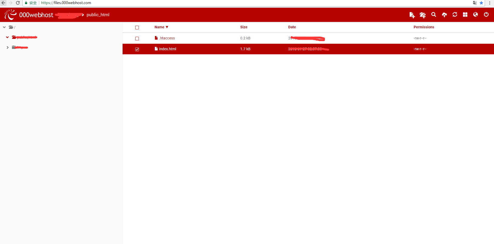
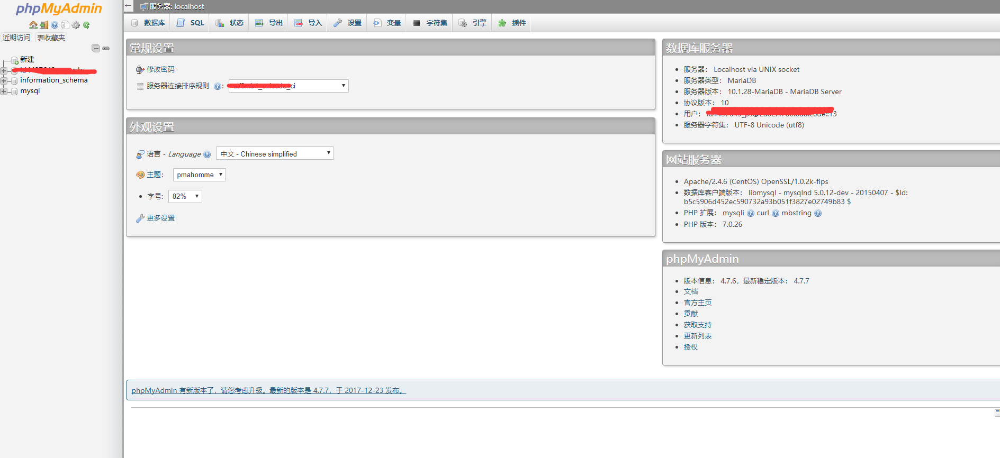

## 部署地址：1、https://www.000webhost.com
* 个人选择国外的服务器，原因很简单：省去很多麻烦；
### 第一步：
* 采用国外邮箱注册（国内IP被屏蔽无法收到验证邮箱）；
### 第二步（根据网站内引导走完流程）：
* 创建web站点账户->验证电子邮箱->创建一个网站->添加网站内容（自行随意写一个index.html文件放入服务器中）- >完成调查（随意填写）->了解网站地址；
* 文件管理地址：https://files.000webhost.com/
* 方法一、请添加host(欧洲的或者自己找其他国外的ip)：31.170.160.209 files.000webhost.com
* 方法二、使用github提供的蓝灯
* 方法三、设置子网掩码：31.170.160.209
 

### 第三步:
* 创建一个数据库(mysql)；
* 地址：https://databases-auth.000webhost.com/index.php
* 如果无法进入：
* 方法一、请添加host(欧洲的或者自己找其他国外的ip)：31.170.160.209 databases-auth.000webhost.com
* 方法二、使用github提供的蓝灯
* 方法三、设置子网掩码：31.170.160.209
 

